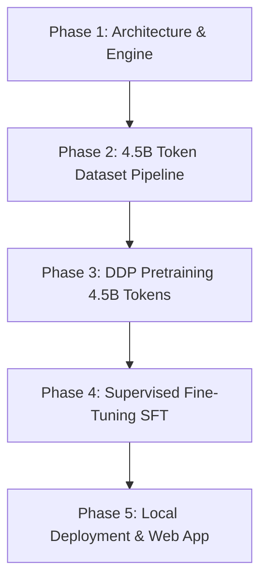

<div align="center">

# 🧠 Axiom V2: Custom 476M Foundation Model

[](https://pytorch.org/)
[](https://github.com/Harshkumar2306/Axiom-V2)
[](https://github.com/Harshkumar2306/Axiom-V2)
[](https://github.com/Harshkumar2306/Axiom-V2)
[](https://github.com/Harshkumar2306/Axiom-V2)
[](LICENSE)

**A 476M Parameter Large Language Model, Distributed Pretraining Engine, and SFT Pipeline built entirely from scratch in PyTorch.**

[Key Highlights](#-key-highlights) • [Architecture](#-architecture-specifications) • [The 4-Phase Pipeline](#-the-4-phase-engineering-lifecycle) • [Quick Start](#-quick-start) • [Local Web App](#-local-web-chat-app) • [Repository Map](#-repository-structure)

</div>

---

## 🌟 Key Highlights

* **100% From-Scratch Neural Architecture:** Built without relying on HuggingFace Transformers wrapper abstractions. Custom implemented RoPE, Grouped-Query Attention (GQA), SwiGLU, RMSNorm, and KV-cache inference.
* **4.5 Billion Token Pretraining:** Trained on dual NVIDIA T4 GPUs in a strict distributed setting with a high-density curated corpus (FineWeb-Edu, code repositories, arXiv scientific texts, and encyclopedic knowledge).
* **Fault-Tolerant Distributed Engine:** Custom `DistributedDataParallel` harness featuring `numpy.memmap` streaming, `model.no_sync()` gradient accumulation (96% communication reduction), and zero-loss `pause.flag` checkpointing for preemptible cloud nodes.
* **Instruction Fine-Tuning (SFT):** Fully functional Supervised Fine-Tuning pipeline, formatting responses into instruction-following templates using cosine warmup schedules.
* **Local Apple Silicon (MPS) & Web Chat UI:** Ready-to-use local FastAPI backend + dark-mode ChatGPT-style frontend, executing offline on Mac Metal (`mps`) or NVIDIA CUDA.
* **Single-Piece Git LFS Weights:** Complete 476M SFT aligned weights (`best.pt`) tracked directly in repository via Git LFS.

---

## 🏛️ Architecture Specifications

```
                              ┌─────────────────────────────┐
                              │     Token Input (B, T)      │
                              └──────────────┬──────────────┘
                                             ▼
                              ┌─────────────────────────────┐
                              │  Embedding (100277 -> 1024) │
                              └──────────────┬──────────────┘
                                             ▼
 ┌────────────────────────────────────────────────────────────────────────────────────────┐
 │  Repeated x24 Transformer Layers                                                       │
 │                                                                                        │
 │         ┌──────────────────────────────────────┐                                       │
 │         ▼                                      │ (Residual Stream)                     │
 │   ┌───────────┐                                │                                       │
 │   │  RMSNorm  │                                │                                       │
 │   └─────┬─────┘                                │                                       │
 │         ▼                                      │                                       │
 │   ┌───────────┐    Rotary Positional Embeddings│                                       │
 │   │  GQA MHA  │ ◄─ [16 Query Heads / 4 KV Heads│                                       │
 │   └─────┬─────┘    rope_theta = 500000.0]      │                                       │
 │         ▼                                      │                                       │
 │       ( + ) ───────────────────────────────────┘                                       │
 │         │                                                                              │
 │         ├──────────────────────────────────────┐                                       │
 │         ▼                                      │ (Residual Stream)                     │
 │   ┌───────────┐                                │                                       │
 │   │  RMSNorm  │                                │                                       │
 │   └─────┬─────┘                                │                                       │
 │         ▼                                      │                                       │
 │   ┌───────────┐                                │                                       │
 │   │  SwiGLU   │ ◄─ [Hidden Dim = 2816          │                                       │
 │   │    FFN    │     multiple_of = 256]         │                                       │
 │   └─────┬─────┘                                │                                       │
 │         ▼                                      │                                       │
 │       ( + ) ───────────────────────────────────┘                                       │
 └─────────┬──────────────────────────────────────────────────────────────────────────────┘
           ▼
    ┌─────────────┐
    │ Final RMS   │
    └──────┬──────┘
           ▼
    ┌─────────────┐
    │ LM Head Out │ ──► Next Token Logits
    └─────────────┘
```

| Hyperparameter | Value | Architectural Rationale |
| :--- | :--- | :--- |
| **Total Parameters** | **476,000,000** (~476M) | Optimal balance of expressive reasoning within low-resource training budgets |
| **Layers (`n_layers`)** | **24** | Sufficient depth to resolve multi-hop logic and syntax hierarchies |
| **Hidden Dim (`d_model`)** | **1024** | High token representational capacity |
| **Attention Heads** | **16 Query / 4 KV** | **Grouped-Query Attention (4:1 ratio)** reduces KV cache VRAM by 75% |
| **Vocab Size** | **100,277** | OpenAI `cl100k_base` (tiktoken) for dense compression of code and natural text |
| **Max Sequence Length** | **2048 Tokens** | Full-context multi-turn dialogue and structured code generation |
| **Feed-Forward Dimension** | **2816** | SwiGLU gating rounded to `multiple_of=256` for optimized Tensor Core tiling |
| **RoPE Base (`rope_theta`)** | **500,000.0** | Extended position frequency for robust long-context handling |
| **Normalization** | **RMSNorm (`eps=1e-5`)** | Upcasted to FP32 to prevent half-precision gradient overflow |
| **Weight Initialization** | **Scaled GPT-style** | Residual branches scaled by `0.02 / sqrt(2 * n_layers)` to preserve variance |

---

## 🔬 The 4-Phase Engineering Lifecycle



### Phase 1: Architecture & Custom DDP Engine
* Custom PyTorch implementation of GQA, SwiGLU, RMSNorm, and Rotary Positional Embeddings with non-persistent frequency buffers.
* Non-reentrant gradient checkpointing (`use_reentrant=False`) cutting activation VRAM by ~50%.
* Fused AdamW kernels and mixed precision with AMP `GradScaler`.

### Phase 2: 4.5 Billion Token Dataset Engineering
* Raw token stream packed into monolithic `uint32` binary memmap chunks (18.00 GB on-disk).
* **Corpus Distribution:**
  * **Educational Web (55% / 2.47B tokens):** Textbooks and deep explainer content (FineWeb-Edu).
  * **Code & Technical Logic (27% / 1.21B tokens):** Python & C++ algorithmic repositories.
  * **Factual Foundations (10% / 450M tokens):** Cleaned encyclopedia corpora.
  * **Scientific Preprints (5% / 225M tokens):** Mathematics, physics, and ML arXiv papers.
  * **Dialogue & Grammar (3% / 135M tokens):** Coherent stories and multi-turn exchanges.

### Phase 3: Distributed Pretraining
* Run on 2x NVIDIA T4 GPUs with `torchrun` and NCCL backend.
* **No-Sync Gradient Accumulation:** Accumulated 32 micro-batches before network synchronization (`model.no_sync()`), slashing inter-GPU overhead by 96%.
* **Resilience:** Handled preemptible cloud timeouts gracefully via asynchronous `pause.flag` triggers and zero-overhead `FastForwardSampler`.

### Phase 4: Supervised Fine-Tuning (SFT)
* Grounded the raw base model into an instruction-following assistant format using ChatML template wrappers:
  ```text
  ### System:
  You are a highly intelligent, logical, and helpful AI assistant named Axiom.

  ### User:
  {prompt}

  ### Assistant:
  {response}
  ```
* Trained with conservative learning rate (`1.5e-5`), cosine warmup, and effective batch size of 64 to prevent catastrophic forgetting.

---

## 💻 Quick Start

### 1. Clone the Repository (with Git LFS)
```bash
git clone https://github.com/Harshkumar2306/Axiom-V2.git
cd Axiom-V2
git lfs pull
```

### 2. Environment Setup
```bash
python3 -m venv venv
source venv/bin/activate
pip install -r "Axiom Model/requirements.txt"
pip install fastapi uvicorn pydantic
```

---

## 🌐 Local Web Chat App

Experience Axiom V2 completely offline on your local machine with our built-in FastAPI web server and dark-mode chat interface. Automatically uses Apple Silicon GPU (`mps`) on macOS or NVIDIA GPU (`cuda`).

```bash
cd "Axiom Model"
python3 app.py
```

1. The server will load `best.pt` into GPU memory:
   ```text
   Loading Axiom V2 on mps...
   ✅ Model loaded successfully! (Val Loss: Unknown)
   INFO:     Uvicorn running on http://0.0.0.0:8000
   ```
2. Open your web browser and navigate to:
   👉 **`http://localhost:8000`**

### UI Features:
* ⚡ **Live Performance Profiling:** Real-time tokens-per-second monitor.
* 🎨 **Markdown Code Highlighting:** Automatic detection and dark-mode rendering of ````python ```` code blocks.
* 🔒 **100% Private & Offline:** Zero external API calls; all neural tensor operations execute on your device.

---

## ⚡ CLI Inference & Testing

Run one-off generations directly from your terminal:

```bash
cd "Axiom Model"

# Generate with the Phase 4 SFT Aligned Model
python3 generate.py \
    --checkpoint "best.pt" \
    --prompt "### System:\nYou are a highly intelligent, logical, and helpful AI assistant named Axiom.\n\n### User:\nWrite a python function to check if a number is prime.\n\n### Assistant:\n" \
    --max_new_tokens 200 \
    --temperature 0.2 \
    --repetition_penalty 1.15
```

Run the automated verification litmus tests:
```bash
python3 test_sft.py
```

---

## 🏋️ Training Reproducibility

### Pretraining (Phase 3)
```bash
NCCL_P2P_DISABLE=1 NCCL_IB_DISABLE=1 torchrun --nproc_per_node=2 "Axiom Model/train_ddp.py" \
    --config "Axiom Model/axiom_model/configs/500M.yaml" \
    --train_data "/path/to/train.bin" \
    --val_data "/path/to/val.bin"
```

### Supervised Fine-Tuning (Phase 4)
```bash
torchrun --nproc_per_node=2 "Axiom Model/train_sft.py" \
    --config "Axiom Model/axiom_model/configs/500M.yaml" \
    --sft_data "dataset/sft/sft_data.pt"
```

---

## 📂 Repository Structure

```text
Axiom-V2/
├── README.md                      # Primary project documentation
├── .gitattributes                 # Git LFS pointer tracking (*.pt)
├── .gitignore                     # Clean environment filter (allows best.pt)
│
├── Axiom Model/                   # Core Model, Training & Serving Directory
│   ├── best.pt                    # Final 476M Phase 4 SFT Weights (1.9GB Git LFS)
│   ├── app.py                     # FastAPI backend local web server
│   ├── generate.py                # High-efficiency inference engine (KV-cache, RoPE, Repetition Penalty)
│   ├── requirements.txt           # Python dependencies
│   │
│   ├── templates/
│   │   └── index.html             # Responsive ChatGPT-style web interface
│   │
│   ├── axiom_model/
│   │   ├── configs/
│   │   │   └── 500M.yaml          # Model architecture and optimizer hyperparameters
│   │   ├── core/
│   │   │   ├── model.py           # AxiomV2 PyTorch Module definition
│   │   │   ├── attention.py       # Grouped-Query Attention (GQA) & RoPE kernels
│   │   │   └── ffn.py             # SwiGLU Feed-Forward Network
│   │   └── training/
│   │       ├── trainer.py         # Standard training harness & loss loop
│   │       ├── checkpoint.py      # Atomic checkpointing with optimizer serialization toggles
│   │       ├── dataloader.py      # Binary memmap high-throughput dataloader
│   │       ├── sft_dataloader.py  # ChatML instruction packing dataloader
│   │       └── profiler.py        # MFU & Hardware throughput profiler
│   │
│   ├── train_ddp.py               # Phase 3: Distributed Pretraining Engine
│   ├── train_sft.py               # Phase 4: Supervised Fine-Tuning Engine
│   │
│   ├── test_sft.py                # Post-SFT verification suite
│   └── test_engine.py             # KV-cache vs non-KV equivalence tests
│
└── Axiom Web/                     # Supplementary Web Artifacts & Ecosystem
```

---

## 🛠️ Key Engineering Breakthroughs

### 1. Slashing Inter-GPU Communication by 96%
Multi-GPU training over consumer PCIe (like Kaggle's dual T4s) is severely bottlenecked by cross-GPU gradient synchronization (NCCL `all_reduce`).
* **Fix:** Using the PyTorch `model.no_sync()` context manager, the gradients are accumulated locally for 31 micro-steps, and only synchronized on the 32nd step. This slashes the NCCL communication penalty, driving hardware utilization (MFU) dramatically higher.

### 2. Memory-Mapped High-Throughput Streaming
Cloud environments enforce strict `/dev/shm` RAM limits, crashing traditional in-memory `DataLoader` pipelines.
* **Fix:** Structured the 4.5B token dataset as a monolithic 18GB binary sequence of `uint32` integers and accessed it via `numpy.memmap`. The OS manages page faults dynamically, allowing massive datasets to stream effortlessly without exhausting physical memory.

### 3. Non-Persistent RoPE Buffer Serialization
Standard PyTorch buffers are saved inside `state_dict`. Registering RoPE frequencies (`freqs_cis`) as persistent creates device mismatch crashes when loading across CPU, CUDA, and Apple MPS.
* **Fix:** Registered via `register_buffer(..., persistent=False)`, allowing dynamic on-device frequency computation.

---

## 📜 License

This project is licensed under the **MIT License** — feel free to use, modify, and build upon this architecture for research and applications.

---

<div align="center">
<b>Built with dedication by <a href="https://github.com/Harshkumar2306">Harsh Kumar</a></b><br>
<i>Proving that foundational AI models can be engineered from scratch.</i>
</div>
