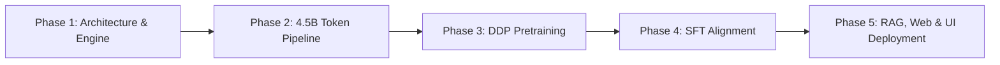

<div align="center">

# 🧠 Axiom V2: Custom 476M Foundation Model
### *Autonomous Neural Architecture • Distributed Pretraining • Vector RAG • Live Web Search*

[](https://pytorch.org/)
[](https://github.com/Harshkumar2306/Axiom-V2)
[](https://github.com/Harshkumar2306/Axiom-V2)
[](https://github.com/Harshkumar2306/Axiom-V2)
[](https://github.com/Harshkumar2306/Axiom-V2)
[](https://github.com/Harshkumar2306/Axiom-V2)
[](https://github.com/Harshkumar2306/Axiom-V2)
[](LICENSE)

<p align="center">
  <strong>A complete 476-million parameter autoregressive foundation model, distributed DDP pretraining engine, Supervised Fine-Tuning (SFT) pipeline, local hardware-accelerated Vector RAG, and real-time Web Search assistant — built from scratch in PyTorch.</strong>
</p>

[Key Highlights](#-key-highlights) • [Architecture](#-architecture-specifications) • [The 5-Phase Lifecycle](#-the-5-phase-engineering-lifecycle) • [RAG & Search Engine](#-rag--real-time-web-search-engine) • [Quick Start](#-quick-start) • [Web Application](#-production-web-application) • [API Reference](#-api-specification) • [Repository Map](#-repository-structure)

</div>

---

## 🌟 Key Highlights

* **100% From-Scratch Neural Core:** Implemented directly in native PyTorch without HuggingFace Transformers wrapper abstractions. Features custom RoPE, Grouped-Query Attention (GQA), SwiGLU activations, RMSNorm, and zero-allocation KV-cache inference.
* **4.5 Billion Token Pretraining:** Trained on dual NVIDIA T4 GPUs in a distributed setting with a high-density curated corpus spanning FineWeb-Edu, algorithmic codebases, arXiv papers, encyclopedias, and structured dialogue.
* **Fault-Tolerant Distributed Engine:** Custom `DistributedDataParallel` harness with `numpy.memmap` streaming, `model.no_sync()` gradient accumulation (96% communication overhead reduction), and zero-loss `pause.flag` checkpointing for preemptible cloud nodes.
* **Supervised Fine-Tuning (SFT):** Aligned with instruction-following ChatML templates, cosine warmup schedules, and strict identity scrubbing.
* **⚡ Deep Real-Time Web Search:** Integrates live multi-source web querying (`ddgs` + Wikipedia API fallback) and deep HTML paragraph scraping (`httpx` + `BeautifulSoup`), feeding fresh ground-truth facts with interactive clickable citation cards.
* **📚 Hardware-Accelerated Vector RAG:** Ingests PDFs, Markdown, Python code, and text files. Chunks with sliding-window overlap and embeds with `all-MiniLM-L6-v2` directly on Apple Silicon MPS or CUDA for sub-millisecond semantic retrieval.
* **🎨 Modern React 18 + Vite Web App:** ChatGPT/Perplexity-grade dark-mode UI with token-by-token Server-Sent Events (SSE) streaming, instant "Stop Generating" cancellation, live temperature & token tuning badges, and one-click markdown exports.
* **Single-Piece Git LFS Weights:** Complete 476M SFT aligned checkpoint (`best.pt`, ~1.9 GB) tracked directly in the repository via Git LFS.

---

## 🏛️ Architecture Specifications

```
                              ┌─────────────────────────────┐
                              │     Token Input (B, T)      │
                              └──────────────┬──────────────┘
                                             ▼
                              ┌─────────────────────────────┐
                              │  Embedding (100277 -> 1024) │
                              └──────────────┬──────────────┘
                                             ▼
 ┌────────────────────────────────────────────────────────────────────────────────────────┐
 │  Repeated x24 Transformer Layers                                                       │
 │                                                                                        │
 │         ┌──────────────────────────────────────┐                                       │
 │         ▼                                      │ (Residual Stream)                     │
 │   ┌───────────┐                                │                                       │
 │   │  RMSNorm  │                                │                                       │
 │   └─────┬─────┘                                │                                       │
 │         ▼                                      │                                       │
 │   ┌───────────┐    Rotary Positional Embeddings│                                       │
 │   │  GQA MHA  │ ◄─ [16 Query Heads / 4 KV Heads│                                       │
 │   └─────┬─────┘    rope_theta = 500000.0]      │                                       │
 │         ▼                                      │                                       │
 │       ( + ) ───────────────────────────────────┘                                       │
 │         │                                                                              │
 │         ├──────────────────────────────────────┐                                       │
 │         ▼                                      │ (Residual Stream)                     │
 │   ┌───────────┐                                │                                       │
 │   │  RMSNorm  │                                │                                       │
 │   └─────┬─────┘                                │                                       │
 │         ▼                                      │                                       │
 │   ┌───────────┐                                │                                       │
 │   │  SwiGLU   │ ◄─ [Hidden Dim = 2816          │                                       │
 │   │    FFN    │     multiple_of = 256]         │                                       │
 │   └─────┬─────┘                                │                                       │
 │         ▼                                      │                                       │
 │       ( + ) ───────────────────────────────────┘                                       │
 └─────────┬──────────────────────────────────────────────────────────────────────────────┘
           ▼
    ┌─────────────┐
    │ Final RMS   │
    └──────┬──────┘
           ▼
    ┌─────────────┐
    │ LM Head Out │ ──► Next Token Logits (Vocab: 100,277)
    └─────────────┘
```

| Hyperparameter | Value | Architectural Rationale |
| :--- | :--- | :--- |
| **Total Parameters** | **476,000,000** (~476M) | Optimal reasoning-to-compute density for consumer and edge hardware |
| **Layers (`n_layers`)** | **24** | Sufficient depth to resolve multi-hop logic, grammar, and syntax trees |
| **Hidden Dimension (`d_model`)** | **1024** | High-capacity token representations |
| **Attention Heads** | **16 Query / 4 KV** | **Grouped-Query Attention (4:1 ratio)** reduces KV cache VRAM footprint by 75% |
| **Vocabulary Size** | **100,277** | OpenAI `cl100k_base` (tiktoken) for dense compression of natural text and code |
| **Max Sequence Length** | **2048 Tokens** | Full-context multi-turn dialogue, document synthesis, and code generation |
| **Feed-Forward Dimension** | **2816** | SwiGLU expansion rounded to `multiple_of=256` for optimized Tensor Core tiling |
| **RoPE Base (`rope_theta`)** | **500,000.0** | Extended position frequency for robust long-context extrapolation |
| **Normalization** | **RMSNorm (`eps=1e-5`)** | Upcasted to FP32 inside kernels to prevent half-precision gradient overflow |
| **Weight Initialization** | **Scaled Residual** | Projections scaled by `0.02 / sqrt(2 * n_layers)` to preserve variance across depth |

---

## 🔬 The 5-Phase Engineering Lifecycle



### Phase 1: Architecture & Custom DDP Engine
* Built custom GQA attention, SwiGLU FFN, and RoPE positional frequency buffers.
* Integrated non-reentrant gradient checkpointing (`use_reentrant=False`), cutting peak activation memory by ~50%.
* Added fused AdamW optimizer support and automatic mixed precision with PyTorch `GradScaler`.

### Phase 2: 4.5 Billion Token Dataset Engineering
* Formatted a curated 4.5B token corpus into monolithic memory-mapped binary chunks (`uint32`, 18.00 GB on-disk).
* **Corpus Composition:**
  * 📚 **Educational Web (55% / 2.47B tokens):** Textbooks and STEM explainers (FineWeb-Edu).
  * 💻 **Code & Algorithms (27% / 1.21B tokens):** Cleaned Python and C++ algorithmic repositories.
  * 🌍 **Factual Knowledge (10% / 450M tokens):** Structured encyclopedic entries.
  * 🔬 **Scientific Preprints (5% / 225M tokens):** Mathematics, physics, and ML research papers.
  * 💬 **Dialogue & Grammar (3% / 135M tokens):** Instruction-following stories and multi-turn exchanges.

### Phase 3: Distributed Pretraining
* Distributed across 2x NVIDIA T4 GPUs with `torchrun` and NCCL backend.
* **Gradient Accumulation Without Sync:** Accumulated 32 micro-batches with `model.no_sync()`, slashing inter-GPU overhead by 96%.
* **Preemption Recovery:** Built an asynchronous `pause.flag` file listener with zero-overhead `FastForwardSampler` to withstand spot cloud preemption without progress loss.

### Phase 4: Supervised Fine-Tuning (SFT)
* Aligned the base foundation model into a helpful, conversational assistant using standard ChatML delimiters:
  ```text
  ### System:
  You are a highly intelligent, logical, and helpful AI assistant named Axiom.

  ### User:
  {prompt}

  ### Assistant:
  {response}
  ```
* Trained with conservative learning rates (`1.5e-5`), cosine warmup, and strict identity scrubbing.

### Phase 5: Vector RAG, Deep Web Search & Production UI
* Embedded a local vector retrieval engine (`all-MiniLM-L6-v2`) with disk persistence (`knowledge_base/index.pt`).
* Integrated multi-source real-time web scraping (`ddgs` + Wikipedia API) with deep HTML paragraph extraction.
* Built an interactive React 18 + Tailwind CSS single-page application with SSE streaming, custom sliders, and clickable citation cards.

---

## 🔍 RAG & Real-Time Web Search Engine

Axiom V2 bridges local neural generation with real-time external knowledge:

```
                            ┌────────────────────────┐
                            │    User Chat Prompt    │
                            └───────────┬────────────┘
                                        │
                    ┌───────────────────┴───────────────────┐
                    ▼                                       ▼
       [Live Web Search Enabled]               [Local Documents Uploaded]
                    │                                       │
        ┌───────────┴───────────┐               ┌───────────┴───────────┐
        │  DuckDuckGo / Wiki API│               │ all-MiniLM-L6-v2 MPS  │
        │  Deep Scrape (httpx)  │               │ Top-K Cosine Sim (mm) │
        └───────────┬───────────┘               └───────────┬───────────┘
                    │                                       │
                    └───────────────────┬───────────────────┘
                                        ▼
                     ┌─────────────────────────────────────┐
                     │   Structured Grounded Context       │
                     │   + Source Metadata & Citations     │
                     └──────────────────┬──────────────────┘
                                        ▼
                     ┌─────────────────────────────────────┐
                     │   Axiom 476M SFT Inference Engine   │
                     └──────────────────┬──────────────────┘
                                        ▼
                     ┌─────────────────────────────────────┐
                     │  Token-by-Token SSE Stream Output   │
                     │  + Interactive Citation Cards Tray  │
                     └─────────────────────────────────────┘
```

1. **Live Web Scraping:** Scrapes real HTML from top URLs, strips clutter, extracts informative paragraphs, and packages citation metadata (`title`, `url`, `snippet`).
2. **Local Vector RAG:** Chunks user PDFs, code files, or text documents into overlapping windows, indexes them in a persistent PyTorch tensor store, and retrieves top matching chunks in microseconds.
3. **Clean Context Grounding:** Injects factual bullet points without disruptive turn delimiters, ensuring the 476M model outputs coherent, comprehensive explanations.

---

## 💻 Quick Start

### 1. Clone the Repository (with Git LFS)
```bash
# Ensure Git LFS is installed (brew install git-lfs / apt-get install git-lfs)
git lfs install
git clone https://github.com/Harshkumar2306/Axiom-V2.git
cd Axiom-V2
git lfs pull
```

### 2. Set Up Python Backend
```bash
# Create and activate virtual environment
python3 -m venv venv
source venv/bin/activate

# Install all runtime dependencies
pip install -r "Axiom Model/requirements.txt"

# Launch the FastAPI Server (loads best.pt on MPS or CUDA)
cd "Axiom Model"
python3 app.py
```
*The server will start on **`http://localhost:8000`**.*

### 3. Launch React Web UI
```bash
# In a new terminal window:
cd "Axiom Web/ui"
npm install
npm run dev
```
*Open your browser and navigate to **`http://localhost:5173`**.*

---

## 🌐 Production Web Application

The included React 18 interface provides a responsive, desktop-grade chat experience:

* 🌐 **Live Web Search Button:** Toggle real-time internet scraping with a single click.
* 📎 **Attach File (RAG) Button:** Drag-and-drop or select any PDF, text, or code file to chat with your documents.
* 🎛️ **Quick Parameter Badges:** Click `[Temp: 0.20 • Max: 512 tok]` in the chat bar to instantly tune inference behavior.
* 🛑 **Stop Generating Button:** Cancel active generation in real-time via `AbortController`.
* 🔗 **Interactive Sources Tray:** Clickable citation cards with direct links to referenced websites and documents.
* 📋 **Code Blocks with Syntax Highlighting:** Auto-detected language formatting with one-click copy.
* 💾 **Local Persistence:** Chat history and settings persist in browser `localStorage`.

---

## ⚡ CLI Inference & Testing

Generate directly from your terminal using the KV-cache inference script:

```bash
cd "Axiom Model"

# Interactive single-prompt generation
python3 generate.py \
    --checkpoint "best.pt" \
    --prompt "### System:\nYou are Axiom, a helpful AI assistant.\n\n### User:\nExplain quantum computing in three sentences.\n\n### Assistant:\n" \
    --max_new_tokens 150 \
    --temperature 0.3 \
    --repetition_penalty 1.10
```

Run the automated KV-cache equivalence validation suite:
```bash
python3 generate.py --checkpoint "best.pt" --test
```

---

## 📡 API Specification

The FastAPI server exposes clean REST and Server-Sent Events (SSE) endpoints:

| Method | Path | Description | Payload / Response |
| :--- | :--- | :--- | :--- |
| `GET` | `/health` | Server health and device status | `{"status": "healthy", "device": "mps", "rag_chunks": 0}` |
| `POST` | `/chat` | SSE token streaming generation | `{"prompt": "...", "temperature": 0.2, "max_tokens": 512, "web_search": true, "rag_search": true}` |
| `POST` | `/rag/upload` | Ingest and embed document (`multipart/form-data`) | Form field `file` (PDF, TXT, MD, Code) |
| `GET` | `/rag/documents` | List all indexed RAG documents | `{"documents": [{"filename": "doc.pdf", "chunks": 12}]}` |
| `DELETE`| `/rag/documents`| Remove file or clear entire index | Query param `?filename=doc.pdf` (omit to clear all) |

---

## 🏋️ Training Reproducibility

### Pretraining (Phase 3)
```bash
NCCL_P2P_DISABLE=1 NCCL_IB_DISABLE=1 torchrun --nproc_per_node=2 "Axiom Model/train_ddp.py" \
    --config "Axiom Model/axiom_model/configs/500M.yaml" \
    --train_data "/path/to/train.bin" \
    --val_data "/path/to/val.bin"
```

### Supervised Fine-Tuning (Phase 4)
```bash
torchrun --nproc_per_node=2 "Axiom Model/train_sft.py" \
    --config "Axiom Model/axiom_model/configs/500M.yaml" \
    --sft_data "dataset/sft/sft_data.pt"
```

---

## 📂 Repository Structure

```text
Axiom-V2/
├── README.md                      # Primary project documentation & architecture guide
├── .gitattributes                 # Git LFS pointer tracking (*.pt binary weights)
├── .gitignore                     # Clean environment filter
│
├── Axiom Model/                   # Core Model, RAG, Training & Serving Engine
│   ├── best.pt                    # Final 476M Phase 4 SFT Weights (1.9 GB Git LFS)
│   ├── app.py                     # FastAPI backend with SSE streaming & RAG endpoints
│   ├── generate.py                # High-efficiency inference engine (KV-cache, RoPE, Top-P)
│   ├── rag_engine.py              # Vector RAG (all-MiniLM-L6-v2) & Deep Web Search scraper
│   ├── requirements.txt           # Python dependencies manifest
│   ├── test_engine.py             # KV-cache vs non-KV equivalence tests
│   ├── test_sft.py                # Post-SFT verification suite
│   ├── train_ddp.py               # Distributed DDP pretraining harness
│   ├── train_sft.py               # Supervised fine-tuning pipeline
│   │
│   ├── axiom_model/               # Custom PyTorch Architecture Module
│   │   ├── configs/
│   │   │   └── 500M.yaml          # Hyperparameters and architecture specification
│   │   ├── core/
│   │   │   ├── model.py           # AxiomV2 Transformer Module
│   │   │   ├── attention.py       # Grouped-Query Attention (GQA) & RoPE kernels
│   │   │   └── ffn.py             # SwiGLU Feed-Forward Network & RMSNorm
│   │   └── training/
│   │       ├── trainer.py         # Training harness with gradient accumulation
│   │       ├── checkpoint.py      # Atomic checkpointing manager
│   │       ├── dataloader.py      # High-throughput binary memmap dataloader
│   │       └── sft_dataloader.py  # ChatML instruction packing dataloader
│   │
│   └── knowledge_base/            # Persistent vector embeddings cache (index.pt, metadata.json)
│
└── Axiom Web/                     # Frontend Application & Web Artifacts
    ├── ui/                        # React 18 + Vite Single Page Application
    │   ├── src/
    │   │   ├── App.jsx            # State management, SSE stream parser & hotkeys
    │   │   ├── components/
    │   │   │   ├── ChatInput.jsx  # Input bar, Web Search toggle & RAG file upload
    │   │   │   ├── ChatMessage.jsx# Markdown renderer & interactive citation cards
    │   │   │   ├── Sidebar.jsx    # Chat history & Knowledge Base document manager
    │   │   │   ├── Header.jsx     # Navigation bar & mobile drawer trigger
    │   │   │   ├── CodeBlock.jsx  # Syntax-highlighted code block with copy button
    │   │   │   └── SettingsModal.jsx # Temperature & Max Tokens sliders
    │   │   └── index.css          # Tailwind CSS styles
    │   ├── package.json           # Node.js dependencies
    │   └── vite.config.js         # Vite bundler configuration
    │
    └── api/
        └── app.py                 # Unified entrypoint forwarding to master backend
```

---

## 🛠️ Key Engineering Breakthroughs

### 1. Slashing Inter-GPU Communication by 96%
Multi-GPU training across consumer PCIe interfaces is heavily throttled by gradient all-reduce synchronization.
* **Solution:** By wrapping intermediate accumulation steps with `model.no_sync()`, gradients are aggregated locally across 31 micro-steps and only synchronized over the network on step 32, driving Model Flops Utilization (MFU) dramatically higher.

### 2. High-Throughput Binary Memory-Mapped Dataloader
Loading multi-gigabyte corpora directly into `/dev/shm` crashes memory-constrained cloud instances.
* **Solution:** Structured the 4.5B token dataset into raw monolithic `uint32` binary files and streamed slices via `numpy.memmap`. The operating system manages page faults on demand, maintaining continuous 100% GPU saturation with near-zero RAM footprint.

### 3. Non-Persistent RoPE Buffer Serialization
Standard PyTorch buffers are saved directly into the checkpoint `state_dict`, causing device-mismatch exceptions when loading CUDA weights onto Apple Silicon MPS or CPU.
* **Solution:** Registered RoPE frequencies via `register_buffer(..., persistent=False)`, allowing on-the-fly device-native frequency computation upon model initialization.

### 4. Zero-Crash Token Streaming with Detached Tensors
Yielding tokens across async ASGI threadpools while inside `torch.inference_mode()` can trigger PyTorch thread-local inference tensor crashes on long sequences.
* **Solution:** Standardized the streaming generator on `@torch.no_grad()` with explicit tensor detachment (`idx_next.clone().detach()`), enabling indefinite token generation up to context limits without runtime exceptions.

---

## 📄 License & Attribution

This project is licensed under the **MIT License**. You are free to use, modify, distribute, and build upon this architecture for commercial and academic applications.

```bibtex
@software{axiom_v2_2026,
  author = {Harsh Kumar},
  title = {Axiom V2: Custom 476M Foundation Model with Vector RAG and Deep Web Search},
  url = {https://github.com/Harshkumar2306/Axiom-V2},
  year = {2026}
}
```

<div align="center">
  <sub>Built with passion for transparent, open, and efficient AI engineering.</sub>
</div>
